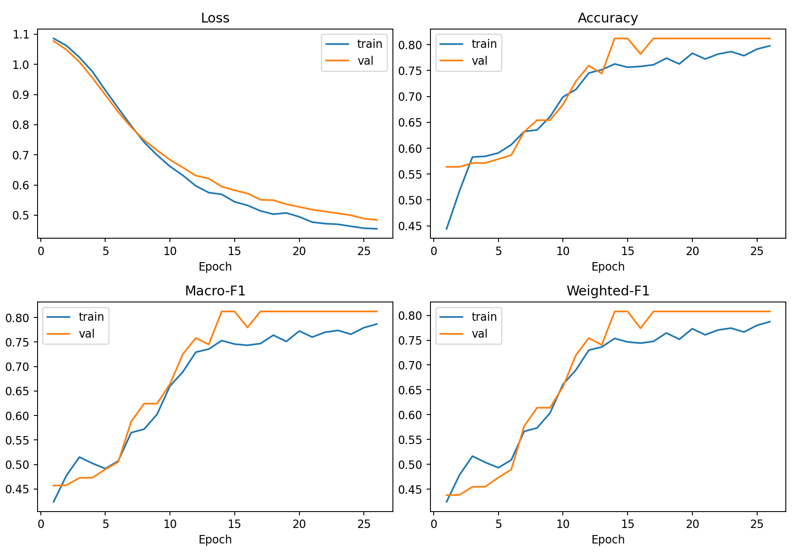
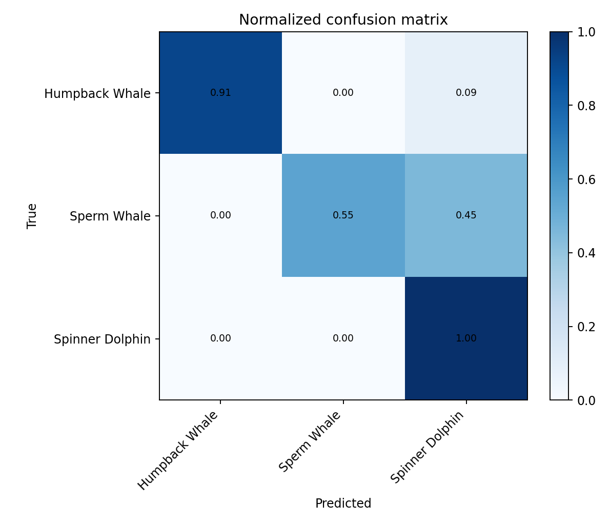
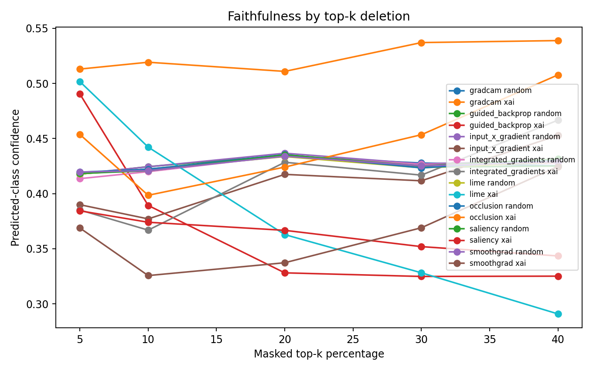
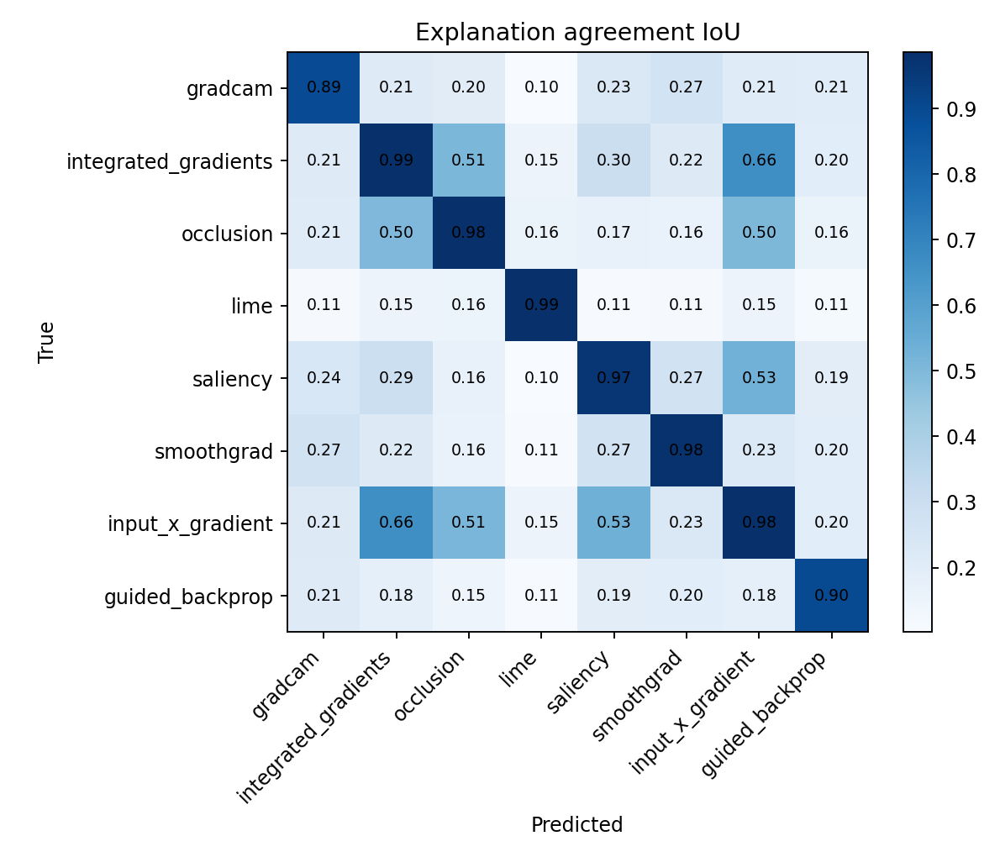
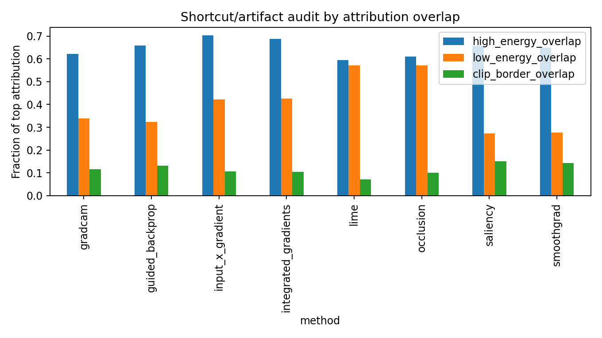
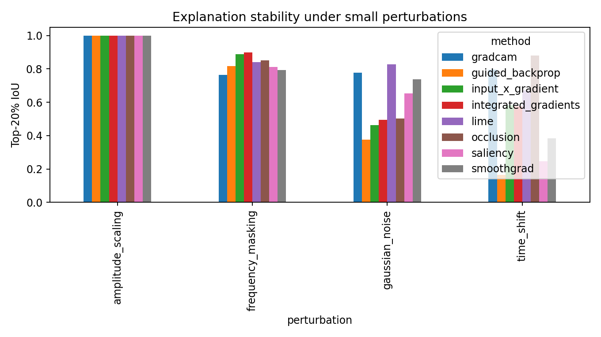

# Marine VGGish XAI: Explainable Marine Mammal Sound Classification

This repository contains a reproducible deep-learning and explainability pipeline for marine mammal acoustic classification. The project uses a pretrained VGGish-style audio model on log-Mel spectrogram inputs and evaluates whether predictions are supported by meaningful time-frequency evidence.

The main goal is not simply to maximize accuracy. The project asks whether a classifier for marine mammal vocalizations appears to rely on acoustic evidence such as calls, clicks, whistles, harmonic structures, and high-energy spectrogram regions, or whether it may rely on shortcut cues such as silence, background noise, clip boundaries, or recording artifacts.

## Table of Contents

1. [Abstract](#abstract)
2. [Research Question](#research-question)
3. [Main Contributions](#main-contributions)
4. [Repository Structure](#repository-structure)
5. [Dataset](#dataset)
6. [Preprocessing](#preprocessing)
7. [Model Architecture](#model-architecture)
8. [Explainability Methods](#explainability-methods)
9. [XAI Evaluation Metrics](#xai-evaluation-metrics)
10. [Results](#results)
11. [Generated Output Artifacts](#generated-output-artifacts)
12. [How to Run](#how-to-run)
13. [Important Files](#important-files)
14. [Interpretation and Limitations](#interpretation-and-limitations)
15. [Future Work](#future-work)
16. [References](#references)

## Abstract

Passive acoustic monitoring can support marine mammal surveys, but deep audio classifiers are difficult to trust when their predictions are not explained. This project evaluates a pretrained VGGish-style classifier on a controlled three-class marine mammal sound classification problem using Humpback Whale, Sperm Whale, and Spinner Dolphin recordings. Audio is converted to mono, resampled to 16 kHz, normalized, segmented into five-second clips, converted to VGGish-compatible log-Mel patches, and split by original source recording to reduce leakage.

The trained model achieves 82.73% test accuracy, 82.05% macro-F1, 82.28% weighted-F1, and 97.12% top-2 accuracy on the grouped held-out test split. Eight explanation methods are evaluated: Grad-CAM, Integrated Gradients, Occlusion Sensitivity, LIME, Saliency, SmoothGrad, Input x Gradient, and Guided Backpropagation. Explanations are assessed using deletion faithfulness, pairwise agreement, perturbation stability, and overlap with high-energy, low-energy, and clip-border spectrogram regions. The results suggest partial alignment with visible acoustic evidence, especially for Input x Gradient and Integrated Gradients, but they do not prove biological reasoning without expert-labeled call regions.

## Research Question

**Does a VGGish-style marine mammal sound classifier rely on biologically meaningful time-frequency evidence, or on shortcut cues?**

The project investigates four specific questions:

- Which spectrogram regions drive predictions?
- Do different XAI methods identify similar regions?
- Are explanations stable under small perturbations?
- Do explanations highlight acoustic activity or possible artifacts?

## Main Contributions

- A reproducible PyTorch pipeline for marine mammal acoustic classification.
- A controlled three-class experiment using Humpback Whale, Sperm Whale, and Spinner Dolphin recordings.
- Grouped train/validation/test splitting by source recording to reduce segment leakage.
- Transfer learning with a pretrained VGGish-style audio classifier.
- Eight XAI methods applied to the same log-Mel input representation.
- Quantitative XAI evaluation using faithfulness, agreement, stability, and energy/artifact overlap.
- Committed output artifacts including metrics, plots, confusion matrices, XAI overlays, and XAI evaluation CSV files.

## Repository Structure

```text
marine_vggish_xai/
|-- README.md
|-- config.yaml
|-- requirements.txt
|-- run_pipeline.py
|-- notebooks/
|   |-- quick_visual_check.ipynb
|-- scripts/
|   |-- 00_download_assets.py
|   |-- 01_collect_watkins_data.py
|   |-- 02_prepare_balanced_subset.py
|   |-- 03_preprocess_audio.py
|   |-- 04_split_dataset.py
|   |-- 05_train_vggish_classifier.py
|   |-- 06_evaluate_test.py
|   |-- 07_run_xai.py
|   |-- 08_evaluate_xai.py
|   |-- 09_generate_report_assets.py
|   |-- generate_docx_report.py
|-- src/
|   |-- config.py
|   |-- data_download.py
|   |-- dataset.py
|   |-- evaluate.py
|   |-- model.py
|   |-- preprocessing.py
|   |-- train.py
|   |-- utils.py
|   |-- visualization.py
|   |-- weights.py
|   |-- xai_gradcam.py
|   |-- xai_gradient_methods.py
|   |-- xai_integrated_gradients.py
|   |-- xai_lime.py
|   |-- xai_metrics.py
|   |-- xai_occlusion.py
|-- outputs/
|   |-- confusion_matrices/
|   |-- logs/
|   |-- metrics/
|   |-- plots/
|   |-- report_assets/
|   |-- test_predictions/
|   |-- xai/
|   |-- xai_evaluation/
```

Raw audio recordings and model checkpoints are intentionally not committed. They should be downloaded or generated locally.

## Dataset

The intended source is the Watkins Marine Mammal Sound Database or a local mirror of real marine mammal recordings. The current experiment uses a balanced controlled subset with three classes.

### Class Summary

| Class | Source clips | Segments | Train | Validation | Test |
|---|---:|---:|---:|---:|---:|
| Humpback Whale | 64 | 300 | 210 | 43 | 47 |
| Sperm Whale | 75 | 300 | 208 | 48 | 44 |
| Spinner Dolphin | 114 | 300 | 210 | 42 | 48 |
| **Total** | **253** | **900** | **628** | **133** | **139** |

### Dataset Design Choices

- The task is intentionally controlled and balanced at 300 segments per class.
- Segments are approximately five seconds long.
- Splits are grouped by original source recording to reduce leakage.
- The dataset is used for explainability analysis, not broad species recognition.

## Preprocessing

Audio preprocessing is implemented in `src/preprocessing.py` and executed through `scripts/03_preprocess_audio.py`.

| Step | Setting |
|---|---|
| Mono conversion | Enabled |
| Sample rate | 16 kHz |
| Clip duration | 5.0 seconds |
| Normalization | Enabled |
| Crop strategy | Energy-based crop/pad |
| VGGish Mel bins | 64 |
| Visual spectrogram Mel bins | 128 |
| FFT size | 1024 |
| Hop length | 160 |
| Window length | 400 |

The preprocessing stage produces both model-ready log-Mel features and visual spectrogram representations used for explanation overlays.

## Model Architecture

The model is implemented in `src/model.py`.

```text
Audio waveform
    -> 16 kHz mono preprocessing
    -> VGGish-compatible log-Mel patches
    -> pretrained VGGish-style convolutional backbone
    -> audio embedding
    -> MLP classifier head
    -> softmax class probabilities
```

### Model Configuration

| Component | Configuration |
|---|---|
| Backbone | VGGish-style CNN |
| Pretraining | Enabled |
| Training mode | `fine_tune_last` |
| Classifier hidden dimension | 256 |
| Dropout | 0.4 |
| Classes | 3 |
| Loss | Cross-entropy |
| Optimizer setup | Configured in `src/train.py` |
| Epochs | 50 |
| Batch size | 16 |
| Learning rate | 0.0001 |
| Backbone learning rate | 0.00001 |
| Weight decay | 0.0001 |
| Early stopping patience | 12 |

The transfer-learning setup is appropriate for a smaller acoustic dataset because the pretrained backbone provides general audio representations while the final layers adapt to the marine mammal task.

## Explainability Methods

Eight explanation methods are applied to the same trained model and log-Mel input representation.

| Method | Type | What It Highlights | Strength | Limitation |
|---|---|---|---|---|
| Grad-CAM | Activation-gradient | Coarse CNN feature regions | Architecture-aware and visually interpretable | Lower spatial resolution |
| Integrated Gradients | Path attribution | Input cells along baseline-to-input path | Axiomatic attribution method | Sensitive to baseline choice |
| Occlusion Sensitivity | Perturbation | Regions where masking drops confidence | Directly tied to prediction changes | Slower and masking-dependent |
| LIME | Local surrogate | Interpretable rectangular regions | Model-agnostic | Depends on segmentation and perturbation design |
| Saliency | Gradient | Local sensitivity of class score | Fast and high resolution | Can be noisy |
| SmoothGrad | Averaged gradient | Noise-smoothed saliency | Reduces some gradient noise | Requires repeated noisy forward/backward passes |
| Input x Gradient | Gradient-weighted input | Input regions with strong sensitivity and magnitude | Strong high-energy alignment in this project | Still gradient-sensitive |
| Guided Backpropagation | Modified gradient | Sharp positive-gradient structures | Detailed visualization | Can be unstable under shifts |

Using multiple methods is important because a single explanation map can look convincing even when it is not faithful or stable.

## XAI Evaluation Metrics

The XAI evaluation is implemented in `src/xai_metrics.py` and executed through `scripts/08_evaluate_xai.py`.

| Metric | Purpose |
|---|---|
| Top-k deletion faithfulness | Masks the top attribution regions and measures predicted-class confidence drop |
| Random deletion baseline | Compares XAI-ranked deletion against random masking |
| Pairwise agreement IoU | Measures whether explanation methods select similar top regions |
| Perturbation stability | Tests explanation consistency under noise, shifts, scaling, and frequency masking |
| High-energy overlap | Checks whether attributions overlap visible acoustic energy |
| Low-energy overlap | Audits possible attention to weak/silent regions |
| Clip-border overlap | Audits possible reliance on segment boundary artifacts |

These metrics are proxy audits. They support cautious interpretation but do not replace expert biological annotation.

## Results

### Training and Validation

The best validation checkpoint occurred at epoch 24.

| Validation Metric | Value |
|---|---:|
| Best epoch | 24 |
| Validation accuracy | 0.8120 |
| Validation macro-F1 | 0.8124 |



### Test Metrics

| Test Metric | Value |
|---|---:|
| Test loss | 0.5389 |
| Accuracy | 0.8273 |
| Macro-F1 | 0.8205 |
| Weighted-F1 | 0.8228 |
| Top-2 accuracy | 0.9712 |

### Per-Class Test Metrics

| Class | Precision | Recall | F1 | Support |
|---|---:|---:|---:|---:|
| Humpback Whale | 1.0000 | 0.9149 | 0.9556 | 47 |
| Sperm Whale | 1.0000 | 0.5455 | 0.7059 | 44 |
| Spinner Dolphin | 0.6667 | 1.0000 | 0.8000 | 48 |

The model performs best on Humpback Whale. Sperm Whale has perfect precision but weaker recall, meaning the model misses many true Sperm Whale examples. Spinner Dolphin has perfect recall but lower precision, meaning some examples from other classes are predicted as Spinner Dolphin.

### Confusion Matrix



The confusion matrix is important because aggregate accuracy hides class-specific behavior. For bioacoustic monitoring, missed detections and false alarms can have different practical consequences.

## XAI Results

### Deletion Faithfulness

Deletion faithfulness measures how much predicted-class confidence drops when the most important attribution regions are masked.

| Method | Best top-k deletion | Mean confidence drop |
|---|---:|---:|
| LIME | 40% | 0.3002 |
| Guided Backpropagation | 30% | 0.2662 |
| SmoothGrad | 10% | 0.2654 |
| Saliency | 40% | 0.2476 |
| Integrated Gradients | 10% | 0.2242 |
| Input x Gradient | 10% | 0.2140 |
| Occlusion Sensitivity | 10% | 0.1925 |
| Grad-CAM | 20% | 0.0801 |



LIME produces the largest deletion-based confidence drop in this experiment. SmoothGrad and Guided Backpropagation are also strong among the gradient-family methods. Grad-CAM is less faithful under this deletion metric, likely because its final-convolution localization is spatially coarser.

### Explanation Agreement

The strongest method agreement is between Integrated Gradients and Input x Gradient.

| Method Pair | Top-20% IoU |
|---|---:|
| Integrated Gradients vs. Input x Gradient | 0.6649 |



This agreement is expected because both methods are gradient-based and preserve input-level time-frequency structure. Agreement across different method families is useful because it gives more support than a single heatmap.

### Energy and Artifact Alignment

The energy audit checks whether top attribution regions overlap high-energy spectrogram regions, low-energy regions, or clip borders.

| Method | High-energy overlap | Low-energy overlap | Clip-border overlap |
|---|---:|---:|---:|
| Input x Gradient | 0.7035 | 0.4216 | 0.1056 |
| Integrated Gradients | 0.6874 | 0.4256 | 0.1050 |
| Guided Backpropagation | 0.6581 | 0.3241 | 0.1309 |
| Saliency | 0.6573 | 0.2730 | 0.1507 |
| SmoothGrad | 0.6484 | 0.2766 | 0.1427 |
| Grad-CAM | 0.6221 | 0.3381 | 0.1160 |
| Occlusion Sensitivity | 0.6098 | 0.5717 | 0.1012 |
| LIME | 0.5955 | 0.5720 | 0.0720 |



Input x Gradient has the strongest high-energy overlap, followed by Integrated Gradients. However, high-energy overlap does not automatically mean biological relevance because high-energy regions can include vocalizations, background noise, or recording artifacts.

### Stability

Stability evaluates whether explanations remain similar under small perturbations such as Gaussian noise, time shift, amplitude scaling, and frequency masking.



LIME, Grad-CAM, and SmoothGrad are relatively stable under Gaussian noise. Some gradient methods are less stable under time shifts, which supports the decision to compare multiple XAI methods instead of relying on one.

## Generated Output Artifacts

The committed `outputs/` folder contains the main generated experiment artifacts.

### Metrics

```text
outputs/metrics/test_metrics.json
outputs/metrics/classification_report.txt
outputs/metrics/epoch_metrics.json
outputs/metrics/species_counts.csv
outputs/metrics/split_class_distributions.csv
```

### Training and Evaluation Plots

```text
outputs/plots/training_loss_curve.png
outputs/plots/training_accuracy_curve.png
outputs/plots/training_macro_f1_curve.png
outputs/plots/training_weighted_f1_curve.png
outputs/plots/learning_rate_curve.png
outputs/confusion_matrices/confusion_matrix_raw.png
outputs/confusion_matrices/confusion_matrix_normalized.png
```

### XAI Outputs

```text
outputs/xai/gradcam/
outputs/xai/integrated_gradients/
outputs/xai/occlusion/
outputs/xai/lime/
outputs/xai/saliency/
outputs/xai/smoothgrad/
outputs/xai/input_x_gradient/
outputs/xai/guided_backprop/
```

Each selected XAI example includes heatmaps, overlays, prediction metadata, and raw attribution arrays.

### XAI Evaluation

```text
outputs/xai_evaluation/faithfulness_topk_deletion.csv
outputs/xai_evaluation/explanation_agreement_iou.csv
outputs/xai_evaluation/stability_results.csv
outputs/xai_evaluation/energy_alignment.csv
```

## How to Run

### 1. Install Dependencies

```bash
pip install -r requirements.txt
```

### 2. Add VGGish Weights

Place a compatible checkpoint at:

```text
models/pretrained/vggish_pytorch.pt
```

Accepted alternatives:

```text
models/pretrained/vggish.pth
models/pretrained/vggish_state_dict.pt
```

### 3. Prepare Data

The project supports the configured Watkins source or a local manual dataset directory. For manually downloaded data, set this field in `config.yaml`:

```yaml
data:
  manual_data_dir: path/to/local/watkins_audio
```

### 4. Run the Full Pipeline

```bash
python run_pipeline.py --config config.yaml
```

### 5. Run a Smaller Debug Smoke Test

```bash
python run_pipeline.py --config config.yaml --debug
```

### 6. Run a Step Range

```bash
python run_pipeline.py --config config.yaml --start_step train --end_step xai
```

### 7. Recompute Existing Artifacts

```bash
python run_pipeline.py --config config.yaml --overwrite
```

## Pipeline Stages

| Stage | Script | Purpose |
|---|---|---|
| 00 | `scripts/00_download_assets.py` | Download required external assets when available |
| 01 | `scripts/01_collect_watkins_data.py` | Collect and index Watkins/local audio files |
| 02 | `scripts/02_prepare_balanced_subset.py` | Build a balanced class subset |
| 03 | `scripts/03_preprocess_audio.py` | Create waveform clips and log-Mel features |
| 04 | `scripts/04_split_dataset.py` | Create grouped train/validation/test splits |
| 05 | `scripts/05_train_vggish_classifier.py` | Train the VGGish-style classifier |
| 06 | `scripts/06_evaluate_test.py` | Evaluate test performance |
| 07 | `scripts/07_run_xai.py` | Generate explanation maps |
| 08 | `scripts/08_evaluate_xai.py` | Compute XAI evaluation metrics |
| 09 | `scripts/09_generate_report_assets.py` | Generate summary plots and report-ready assets |

## Important Files

| File | Description |
|---|---|
| `config.yaml` | Main experiment configuration |
| `run_pipeline.py` | End-to-end pipeline runner |
| `src/model.py` | VGGish-style model and classifier head |
| `src/preprocessing.py` | Audio segmentation and log-Mel generation |
| `src/train.py` | Training loop |
| `src/evaluate.py` | Test evaluation and XAI orchestration |
| `src/xai_gradcam.py` | Grad-CAM implementation |
| `src/xai_integrated_gradients.py` | Integrated Gradients implementation |
| `src/xai_occlusion.py` | Occlusion sensitivity implementation |
| `src/xai_lime.py` | LIME implementation |
| `src/xai_gradient_methods.py` | Saliency, SmoothGrad, Input x Gradient, and Guided Backpropagation |
| `src/xai_metrics.py` | Faithfulness, agreement, stability, and energy/artifact evaluation |
| `src/visualization.py` | Plotting and report asset generation |

## Interpretation and Limitations

The main interpretation is cautious:

> The model often appears to rely on visible acoustic evidence, but the current XAI results should be treated as diagnostic evidence rather than proof of biological reasoning.

Important limitations:

- The task uses three classes and should not be treated as a general marine mammal species recognizer.
- Segment-level examples do not create fully independent biological diversity.
- Raw recordings and pretrained model weights are not included in the repository.
- XAI metrics are proxy evaluations.
- High-energy overlap may reflect calls, noise, or recording artifacts.
- Deletion and occlusion can create out-of-distribution spectrograms.
- Expert-labeled call regions are needed for stronger biological validation.
- External validation across recording devices and environments remains future work.

## Future Work

Useful next steps include:

- Expand to more species and more source recordings.
- Evaluate on an external recording-source test set.
- Add expert-labeled time-frequency regions for calls, clicks, whistles, and harmonics.
- Run saliency sanity checks with randomized weights and labels.
- Compare VGGish with underwater-acoustics-specific architectures.
- Add insertion curves and counterfactual audio perturbation tests.
- Evaluate robustness across background noise levels and recording devices.

## References

The project design is based on standard work in audio representation learning and explainable deep learning:

- Hershey et al., "CNN Architectures for Large-Scale Audio Classification," ICASSP 2017.
- Gemmeke et al., "Audio Set: An ontology and human-labeled dataset for audio events," ICASSP 2017.
- Selvaraju et al., "Grad-CAM: Visual Explanations from Deep Networks via Gradient-based Localization," ICCV 2017.
- Sundararajan et al., "Axiomatic Attribution for Deep Networks," ICML 2017.
- Ribeiro et al., "Why Should I Trust You? Explaining the Predictions of Any Classifier," KDD 2016.
- Smilkov et al., "SmoothGrad: removing noise by adding noise," 2017.
- Zeiler and Fergus, "Visualizing and Understanding Convolutional Networks," ECCV 2014.
- Adebayo et al., "Sanity Checks for Saliency Maps," NeurIPS 2018.

## Data Notice

This repository contains code and generated output artifacts. Raw Watkins audio recordings should be obtained from their original source or an authorized mirror and used according to the dataset's terms.
